# QRSMS

QRSMS - QR based Student Management System. built using React, Python Django, PostgreSQL. Three Portals. One for Teachers, One for Students and One for Faculty. A Flutter App where Students can view and mark their attendance using QR-Code option.

QRSMS is built on Django Web Framework which provides a extensible environment for Future Extension and Up-gradation.

A Restful Architecture allows for portability and future scalability. Python Environment is managed by Pipenv. The Front-end is powered by the Leading Web Library, React. Bootstrap alongside with Semantic-UI allow for a robust and Well-Polished Web interface. SQLite and PostgreSQL are used in Development and Production, respectively. 

## Team

|  |  |  |
| :---------------------------------------------------------------------------------------------- | :--------------------------------------------------------------------------------------------: | ------------------------------------------------------------------------------------------------: |
| [Noman Anjum](https://github.com/NomanAnjum09)                                                  |                         [Hassan Ahmed](https://github.com/hassan11196)                         |                                                    [Ahsan Ali](https://github.com/MuhammadAichee) |

## QRSMS Teacher Portal: 

### Link: [qrsms-teacher.netlify.app](qrsms-teacher.netlify.app)

### Repo Link: [https://github.com/hassan11196/QRSMS-Teacher](https://github.com/hassan11196/QRSMS-Teacher)

### Images:
- 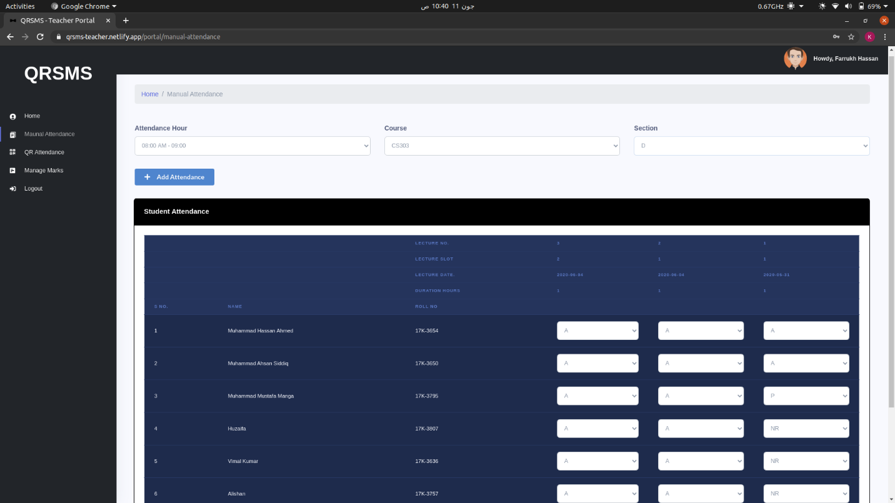
- 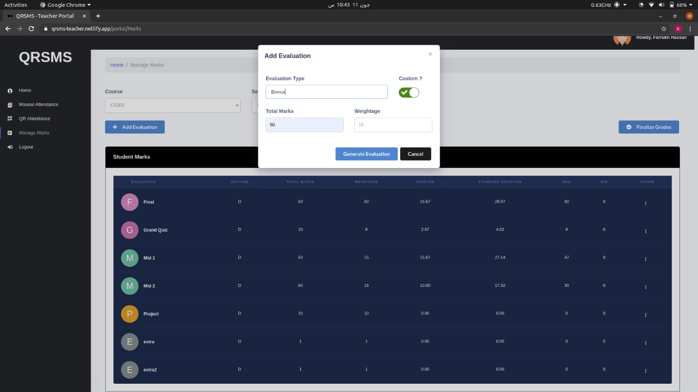
- 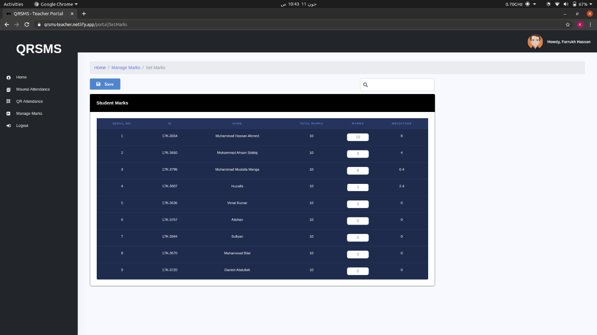

## QRSMS Student Portal: 

### Link: [qrsms-student.netlify.app](qrsms-student.netlify.app)

### Repo Link: [https://github.com/hassan11196/QRSMS-Student](https://github.com/hassan11196/QRSMS-Student)

### Images:
- 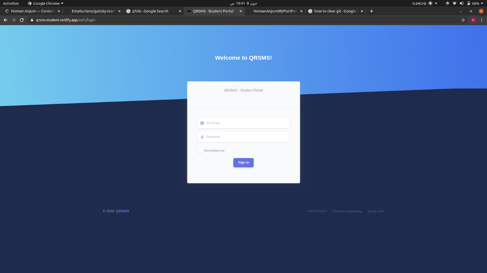
- 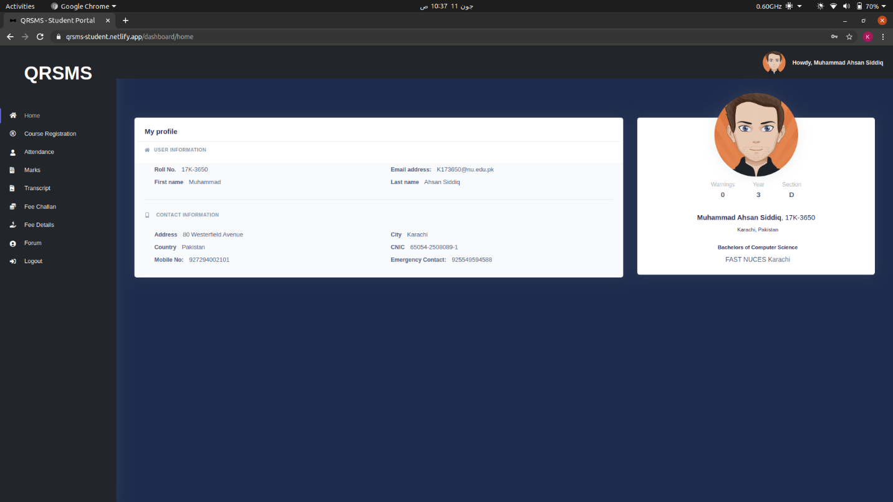
- 

## QRSMS Admin Portal:
Customized Django Admin Portal for Faculty of the University to manage QRSMS.
### Link: [Click here](https://qrsms-v1.herokuapp.com/admin)

### Images:
- 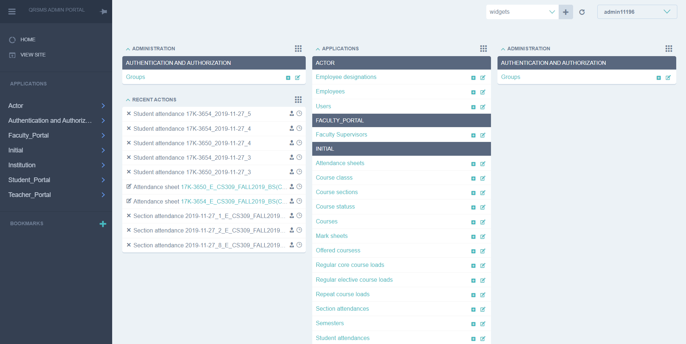
- 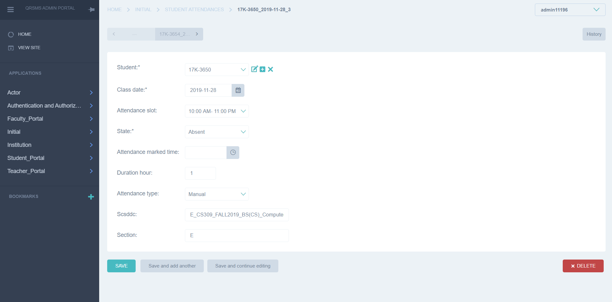
- 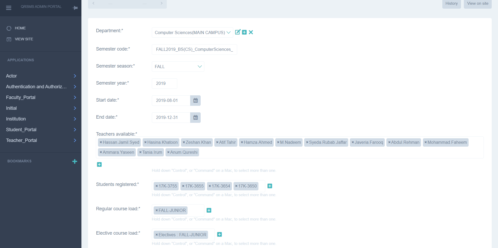

## QRSMS Flutter Application: 

### Download Link: [Click here](https://github.com/hassan11196/QRSMSApp/releases)

### Repo Link: [https://github.com/hassan11196/QRSMSApp](https://github.com/hassan11196/QRSMSApp)

Made Possible with help of following additional contributors and mentors💓:

||
||

### Images:
| 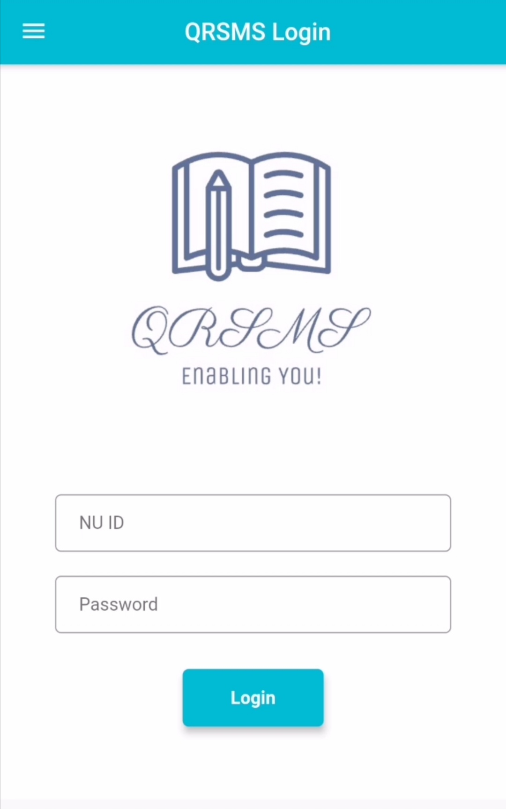 | 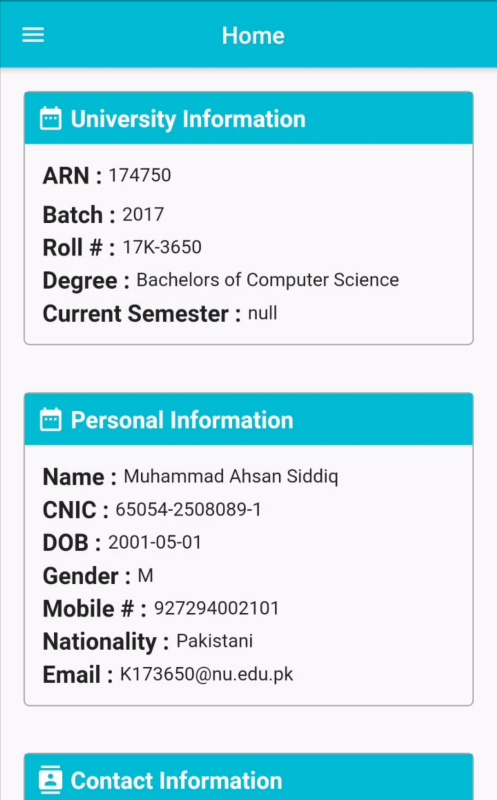 | 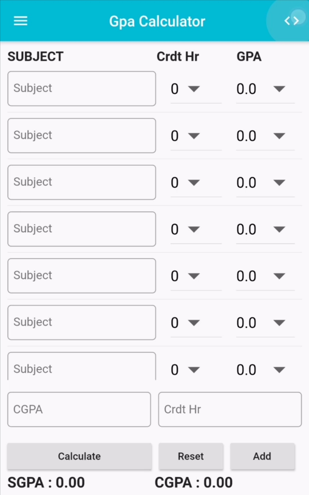 | 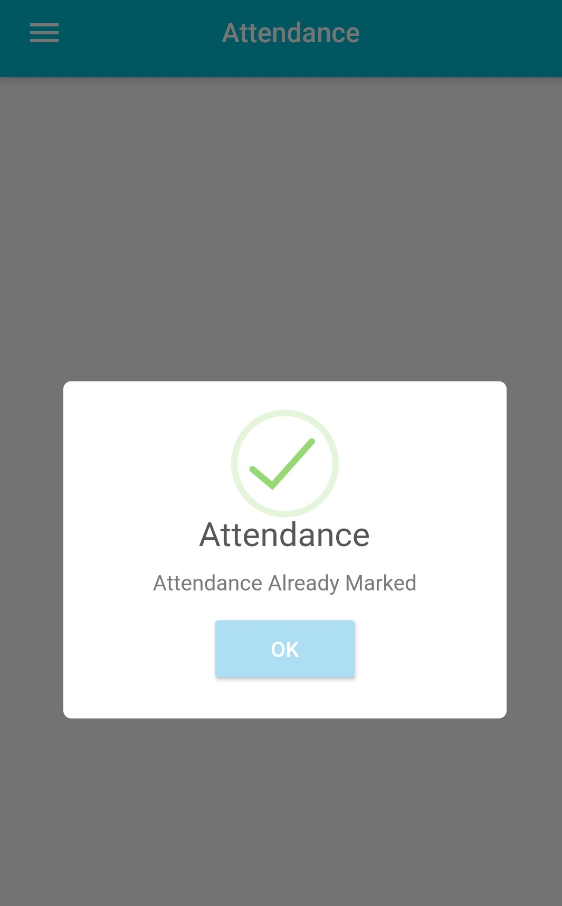 |
| :------------------------ | :-----------------------: | ------------------------: | ------------------------: |

